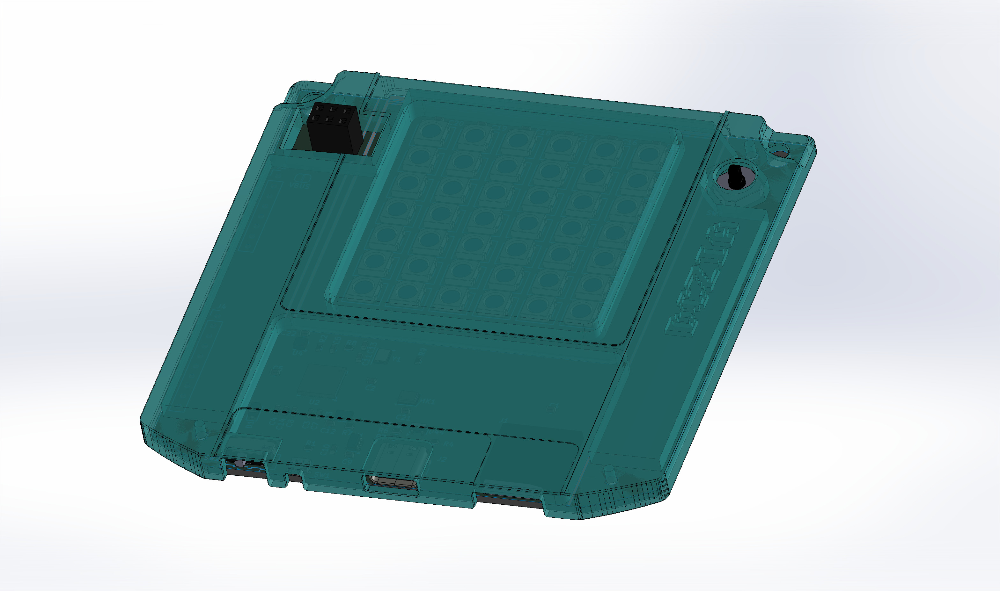
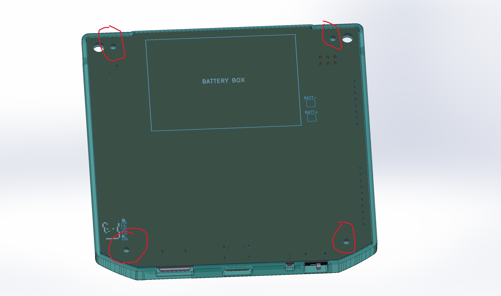

# Zippy Shell

The DCZia Zippy Badge was designed with a translucent shell to both protect the electronics as well as to give that retro vibe.  Included here are the source files for the shell so you can make your own.

The SolidWorks files were made with the Maker's edition, which may give you problems if you actually have access to the real version.

Additionally, a STEP file of the PCB board is provided, along with the SolidWorks assembly of the whole badge so you can see how your modeling changes affect the shell.

STEP is a bit better for doing changes with in CAD.  STL is what most slicers use, so you can use your slicer to make mods as well - but you can usually import STEP files as well.

Two different shells are provided:  

## Flat
 

The 'flat' one is designed to work on a FDM printer.  Print it with the flat side down.  10% infill is good enough.

## Curved

The 'curbed' one is like the original Zip disk with the curved outer edges.  This one works well for resin printing.

## Mounting

To mount the shell, there are 4 bolt holes provided, that work with M2 bolts, 4mm long.  Press firmly as you screw in - the plastic easily strips, but this method also works pretty well at this size, so... good luck.  The bolt hole locations are circled in red.

